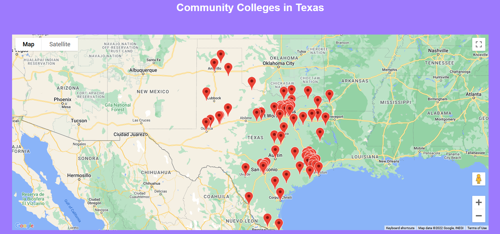

# Google Maps API - Texas Community Colleges

Using Google Maps [Geocoding API](https://developers.google.com/maps/documentation/geocoding/overview) & [Javascript API](https://developers.google.com/maps/documentation/javascript/adding-a-google-map) to display map markers for all of the community colleges in Texas ([Data Source](http://www.txhighereddata.org/Interactive/Institutionsshow.cfm?Type=1&Level=2))
* Also used Pandas & Regex libraries for data manipulation 

### Output (`locations_map.html`)

## TO-DO
* Read Javascript Maps API (and get more familiar with Javascript in general) & implement event listeners for map markers
* Update my ugly HTML/CSS
* Find a way to add another field/array item in Javascript file for the community college name only